# 🧠 Indian Crime Risk Analysis (2016–2018)

> A Data Science Project on Crime Patterns, Risk Indexing, and Predictive Modeling using Indian Government NDAP Data  
> 📊 Dataset: [NDAP Crime Report (2016–18)](https://ndap.niti.gov.in/dataset/7042)

---

## 📍 Overview

This project explores state-wise crime statistics across India from 2016–2018 using official NDAP data. It combines exploratory data analysis (EDA), a custom **Crime Risk Index (CRI)**, geospatial mapping, and a simple machine learning model to predict crime risk levels for each state.

---

## 🎯 Objectives

- Analyze and visualize crime patterns across Indian states  
- Engineer a composite **Crime Risk Index** based on weighted indicators  
- Identify high-risk states using geospatial analysis  
- Predict risk categories using a simple, interpretable ML model

---

## 📦 Key Features

- 📊 EDA on categories like **women-related crimes**, **property crimes**, **cybercrime**, and more  
- 🧮 Custom **Risk Index** using weighted normalization of crime indicators  
- 🗺️ **GeoPandas** for crime-based Indian state-level mapping  
- 🤖 Logistic Regression model to predict risk levels (Low to Very High)

---

## 📸 Visual Insights

| 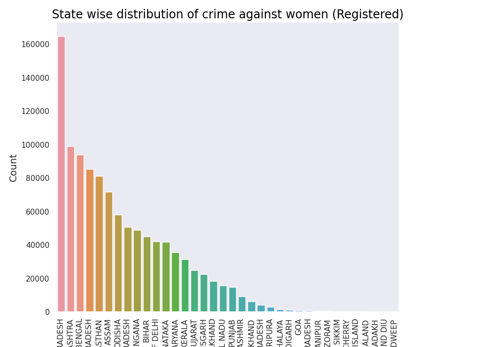 | 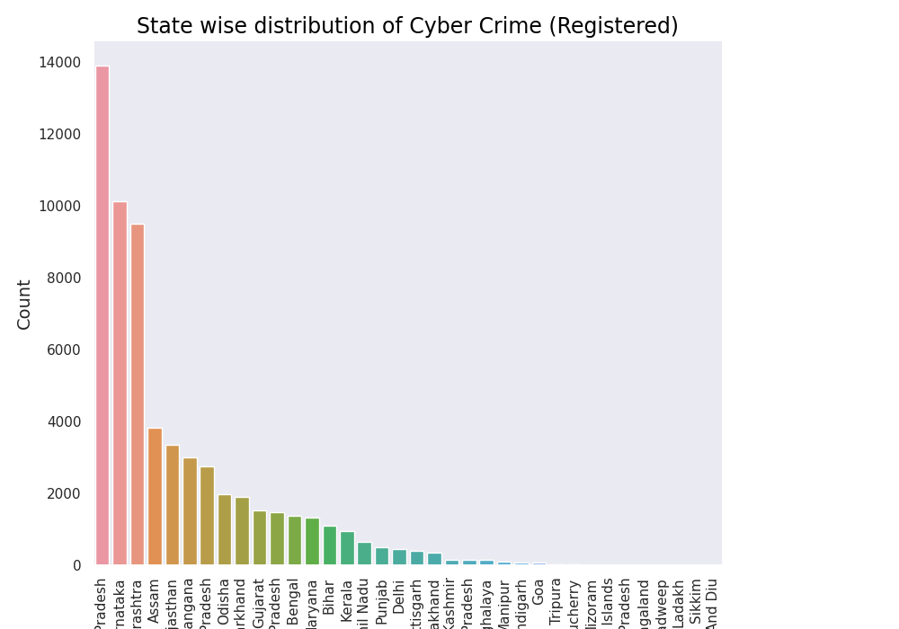 | 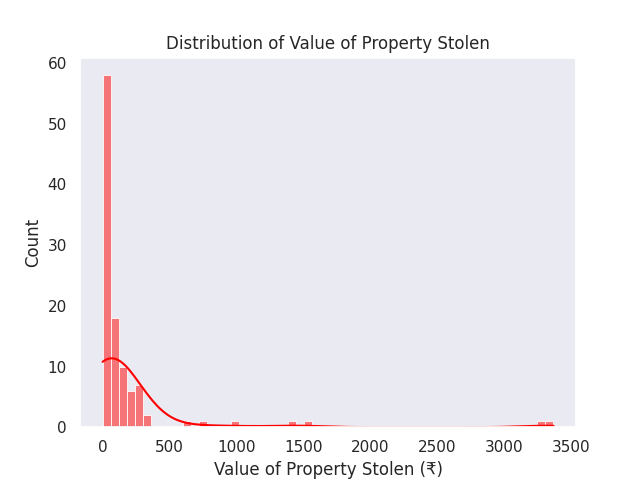 |
|:---------------------------------------:|:-------------------------------:|:-----------------------------------------------:|
| 🔺 **Crimes Against Women**             | 💻 **Cyber Crimes**             | 💰 **Property Stolen**                          |

| 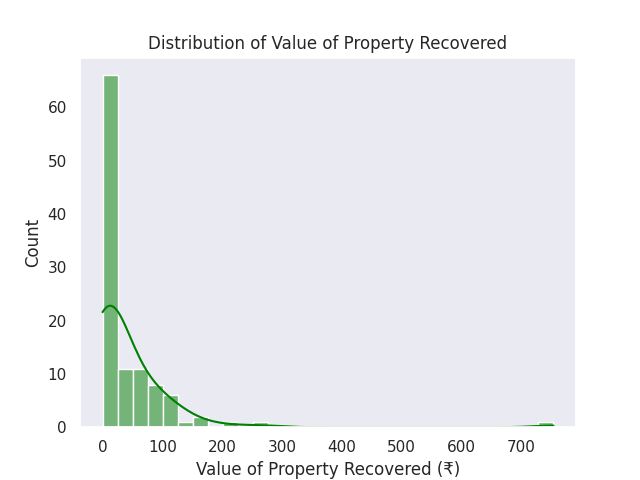 | 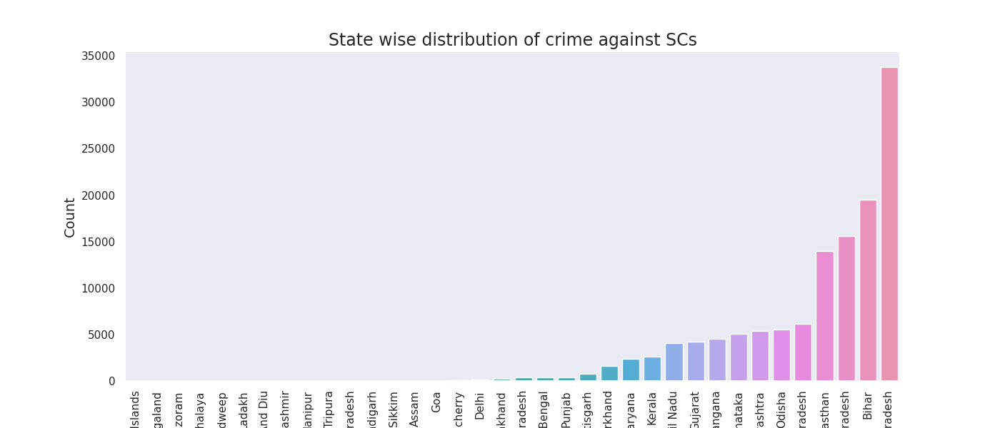 | 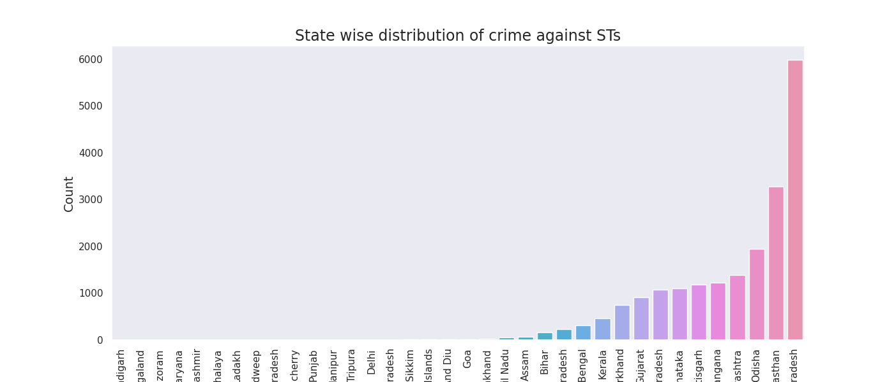 |
|:---------------------------------------------------:|:-----------------------------------:|:----------------------------------:|
| 💸 **Property Recovered**                           | 🙍‍♂️ **Crimes Against SCs**         | 🧑‍🌾 **Crimes Against STs**         |

| 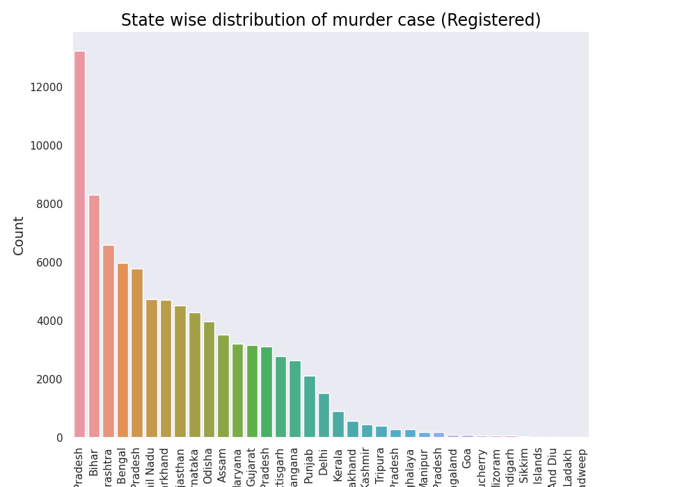 | 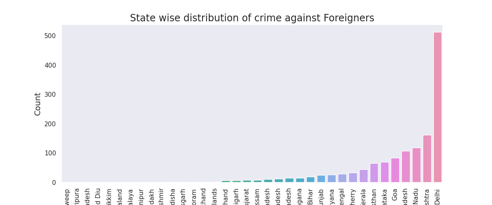 | 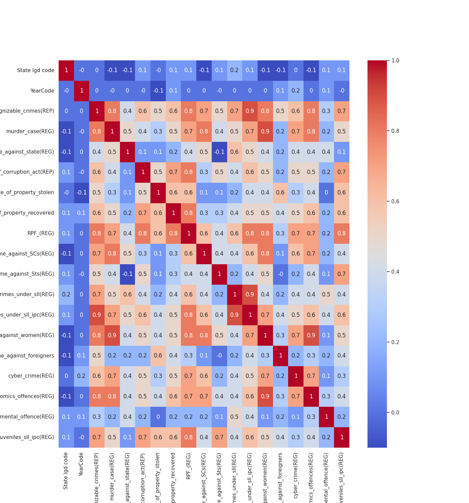 |
|:--------------------------------:|:--------------------------------------------------:|:------------------------------:|
| 🔪 **Murder Cases**              | 🌍 **Crimes Against Foreigners**                   | 🔥 **Feature Correlation Heatmap** |

| 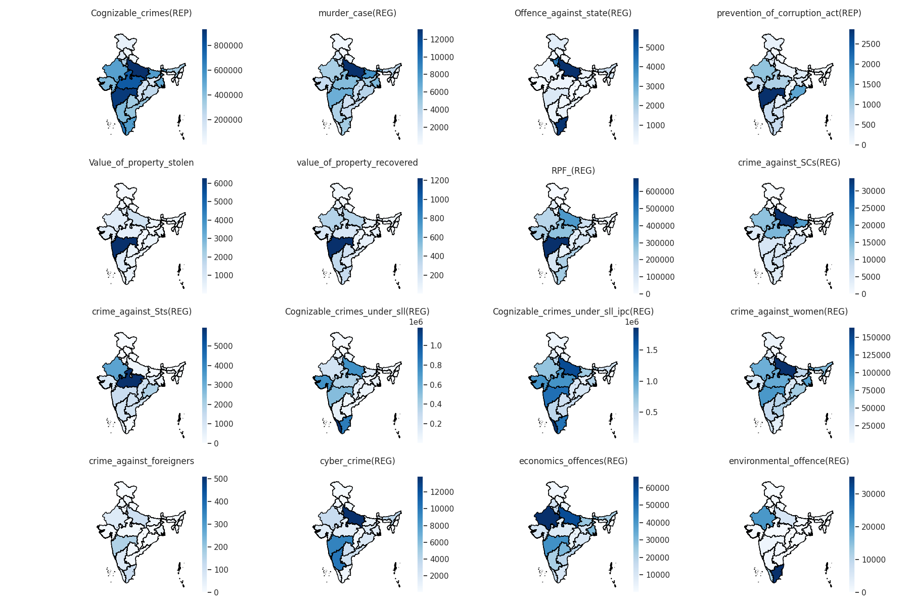 | 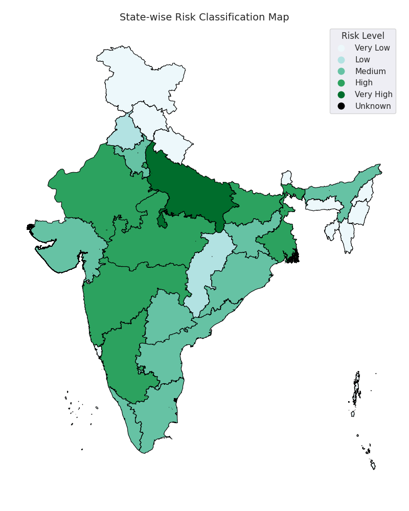 |
|:--------------------------------:|:-------------------------------------:|
| 🗺️ **Base India Map**           | 🚨 **Final Crime Risk Index Map**     |

---

## 📊 Methodology

### 🔎 1. Data Understanding
- Analyzed datatypes, null values, and value distributions  
- Renamed cryptic columns for better interpretability

### 📈 2. EDA
- State-wise visualizations of key crime metrics  
- Comparative plots across multiple years  
- Correlation analysis of all numerical variables

### 🧠 3. Crime Risk Index (CRI)
- Normalized selected features like murder, cybercrime, women-related crimes, etc.  
- Applied domain-relevant weights to each indicator  
- Aggregated to form a scaled 0–100+ risk score  
- Classified into: **Very Low, Low, Medium, High, Very High**

### 🤖 4. Modeling
- Target: `Risk_index_mapped` (risk class)  
- Model: `Logistic Regression`  
- Pipeline: `StandardScaler + OneHotEncoder` + Model  
- Evaluation using accuracy and a few predicted samples

---

## 🧠 Final Thoughts

This project turns real-world government data into actionable insight by applying layered analytics — from visualization to modeling. The **Crime Risk Index (CRI)** built here allows for strategic interpretation of raw crime data, aiding in smarter governance and safety planning.

It also shows how simple tools and models, when applied thoughtfully, can yield powerful insights — even without heavy ML pipelines.

---

## 👤 Contact

- **👨‍💻 GitHub**: [BhaskarMishra05](https://github.com/BhaskarMishra05?tab=repositories)  
- **🔗 LinkedIn**: [Bhaskar Mishra](https://www.linkedin.com/in/bhaskar-mishra-026848221/)  
- **🏆 Kaggle**: [Bhaskar Mishra](https://www.kaggle.com/bhaskarmishra44796)  

---

> ⭐ Star this repo if you found it useful — feedback and collaboration are always welcome!
